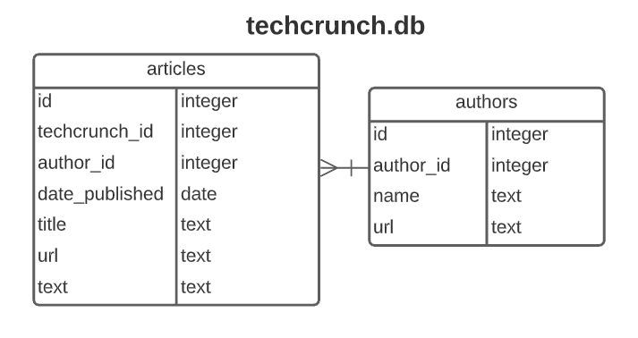

# TechCrunch Challenge Overview

# Setup

## Requirements

- Python 3.8+

## Installation

After creating a virtual environment through your preferred method then install requirements:

```text
$ pip install -r requirements.txt
```

Create empty database tables:

```text
$ python db/create_tables.py
```



# Usage

After installating the requirements and building the database, the `etl_techcrunch.py` script can be run to populate the database:

```text
$ python etl_techcrunch.py
... Extracting articles from techcrunch.com ...
... Transforming articles to match db schema ...
... Extracting authors from techcrunch.com ...
... Transforming authors to match db schema ...
... Loading authors to database ...
... Loading articles to database ...
```

After the database is loaded, I included a sql sandbox file called `sqlite_sandbox.py` you can use to examine the database. Try editing the file and running it:

```text
$ python sql_sandbox.py
  id  techcrunch_id  author_id      date_published  ...  id  author_id              name                                              url
0  1        2119321   31035538 2021-03-01 23:10:22  ...  18   31035538        Anthony Ha        https://techcrunch.com/author/anthony-ha/
1  2        2119142    2414667 2021-03-01 22:59:14  ...   7    2414667       Sarah Perez       https://techcrunch.com/author/sarah-perez/
2  3        2118539   59254947 2021-03-01 22:49:21  ...  21   59254947  Jonathan Shieber  https://techcrunch.com/author/jonathan-shieber/
3  4        2119253     521068 2021-03-01 21:53:33  ...   3     521068        Ron Miller        https://techcrunch.com/author/ron-miller/
4  5        2119133  113760560 2021-03-01 21:36:14  ...  27  113760560   Taylor Hatmaker   https://techcrunch.com/author/taylor-hatmaker/

[5 rows x 11 columns]
<class 'pandas.core.frame.DataFrame'>
RangeIndex: 100 entries, 0 to 99
Data columns (total 11 columns):
 #   Column          Non-Null Count  Dtype
---  ------          --------------  -----
 0   id              100 non-null    int64
 1   techcrunch_id   100 non-null    int64
 2   author_id       100 non-null    int64
 3   date_published  100 non-null    datetime64[ns]
 4   title           100 non-null    object
 5   url             100 non-null    object
 6   text            100 non-null    object
 7   id              100 non-null    int64
 8   author_id       100 non-null    int64
 9   name            100 non-null    object
 10  url             100 non-null    object
dtypes: datetime64[ns](1), int64(5), object(5)
memory usage: 8.7+ KB
None
```

Alternatively, you can view the tables in a GUI. If using VSCode, you can find a sqlite extension and add it. Then, when right clicking the `techcrunch.db` file, you'll be able to select an option to view the data.

# Testing

```text
$ python test_etl_techcrunch.py
.
----------------------------------------------------------------------
Ran 1 test in 0.197s

OK
```

# Notes

At a high level, once the requirements are installed and the database is created, the program flow is separated into three distinct phases: extract, transform, and load. The extract process calls the WordPress API requesting the last 100 articles published on techcrunch.com. Next, the transform phase reads the API response and parses out the required data points per article, strips out HTML tags, transforms the data into a Pandas dataframe and casts the columns into appropriate data types. Next, a list of `author_id`s is pulled from the article data. A call to the API is then made to retrieve the authors. Finally, in the load phase, the program loads the dataframes into sqllite database tables.

The email instructions for this coding challenge linked to Version 2 (v2) of the Wordpress API. Unfortunately, v2 doesn't include an author endpoint. I suspected that there might be such an endpoint in Version 1 (v1). I couldn't find v1 documentation, but I was able to examine the Techcrunch website's network traffic and find the endpoint that way. From there I was able to see the author API call in action and the url gave me a clue on how to find the v1 documentation. Once I found the documentation, I was able to finish coding the author API request. Fortunately, both the article and author endpoints support a `per_page=100` parameter which let me request all 100 articles and authors without having to make multiple API calls.

I initially wrote the code in a single file as procedural code. You can see that in the `scratchwork.py` file. If this were a one-off project, then that might suffice, but I decided to refactor the code in an object oriented programming (OOP) style. OOP code is better suited to handle complexity and to modularize code. For example, there are several features which can be added to this program and continuing on with a single file would prove hard to manage.

# TO DO:

The instructions requested the last 100 TechCrunch articles, and luckily the API can respond with that many in a single call. Thus, there was no need to time my interactions with the API because I'd only need to make a single call. I was able to hardcode this 100 article amount into the API endpoint I called. For future development, I would like to pass a parameter to the extract script. The parameter would specify how many articles to retrieve and make that dynamic in the code. If retrieving more than 100 articles, then I would need to be mindful of how fast I was calling the API. To handle that, I might ask my program to `sleep` for random amounts of milliseconds between successive API calls. Similarly, the author endpoint let me retrieve 100 authors at a time. I would need to do all of the above for the authors API call as well.

Next, I would like to write some code ensuring there are no duplicate articles being sent back by the API. I manually tested this over the latest several hundred articles and didn't come across any duplicates. In my limited anecdotal experience, I didn't see a need to code for this especially since I was limited in time. It wouldn't be a difficult feature to add, and I would handle it in the next iteration.

Next, I would like to automate the overall process as a data pipeline complete with error handling. There's a popular library in use called Airflow which can automate running these scripts. Airflow would run the code on a set schedule and allow you to decide what to do in case of errors. For example, every morning, Airflow could kick off the ETL job and update our collection of articles. If there were any errors in the process, Airflow would know how to handle them gracefully. For example, the extract phase might fail making an API call. Airflow could be programmed to retry the API call on error, and after a certain amount of failed retries, an email or text message might be sent out alerting the tech team.

Next, I would like to take time to make sure I pay special attention to the text encoding. I noticed there were a few characters, mainly apostrophes, that were displayed in a different encoding. For production-ready code, I would need to make sure the database is consistent with it's character encoding.

Next, right now, the id values in the tables are a bit disorganized. There are `id`, `author_id`, and `techcrunch_id` columns in the tables. I would like to tidy this up in a future interation.

Finally, I would like to make a richer test suite. Right now I didn't have a lot of time, so my single test is essentially testing that the extract script can make an API call. In the future, I would like to "mock" the API response and use that to test the entire process.
